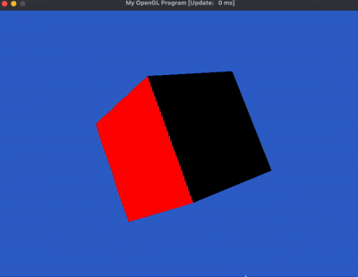
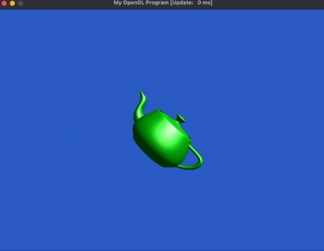
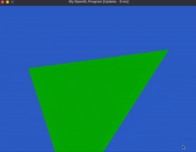

# OpenGL

## Part A: Demo Screenshots 
### 1. TriangleColored.cpp 

A simple 2D colored triangle demonstrating basic OpenGL rendering. The triangle has three vertices with different colors (red, green, blue) that interpolate smoothly across the surface using the fragment shader.

  

g++ -std=c++11 -Wno-deprecated TriangleColored.cpp glad/glad.c -o TriangleColored \
    -I./include -I/opt/homebrew/include -L/opt/homebrew/lib \
    -lSDL2 -framework OpenGL

Used -Wno-deprecated to avoid unnecessary warnings [1].
[1] https://gcc.gnu.org/onlinedocs/gcc/Warning-Options.html

### 2. Cube3D.cpp
A rotating 3D cube with different colored faces demonstrating 3D transformations. 

  

g++ -std=c++11 -Wno-deprecated Cube3D.cpp glad/glad.c -o Cube3D \
    -I./include -I/opt/homebrew/include -L/opt/homebrew/lib \
    -lSDL2 -framework OpenGL

### 3. CubeLit.cpp

  

g++ -std=c++11 -Wno-deprecated CubeLit.cpp glad/glad.c -o CubeLit \
    -I./include -I/opt/homebrew/include -L/opt/homebrew/lib \
    -lSDL2 -framework OpenGL
    
### 4. ModelLoad.cpp

  

  

  

g++ -std=c++11 -Wno-deprecated ModelLoad.cpp glad/glad.c -o ModelLoad \
    -I./include -I/opt/homebrew/include -L/opt/homebrew/lib \
    -lSDL2 -framework OpenGL
    
## Part B: Quick Check Questions

# Q1. 
In Cube3D.cpp we call glEnable(GL_DEPTH_TEST). Remove this call, how  do you explain the resulting image?

  

Without 'glEnable(GL_DEPTH_TEST)', OpenGL does not use the depth buffer to determine which fragments are closest to the camera. Instead, triangles are rendered in the order they appear in the vertex array. This causes the "painter's algorithm" problem where triangles drawn later appear on top of previous triangles, even if they are behind them in 3D space [1]. 

[1] Reference: https://learnopengl.com/Advanced-OpenGL/Depth-testing

# Q2. 
Currently, all of our examples exit when Escape is pressed. Update the code to  also exit when the “Q” key is pressed. What did you need to change?

I added this: if (windowEvent.type == SDL_KEYUP && windowEvent.key.keysym.sym == SDLK_q)
    quit = true;
the way it was used for escape 

# Q3. 
In CubeLit.cpp change the shader so the light is coming from below the cube. What change did you make?
The original light direction was from up : const vec3 lightDir = vec3(0,1,1);
I change it to come from down, -y, -1: const vec3 lightDir = vec3(0,-1,1);

# Q4. 
Create a new model file, by hand, that contains a single large triangle. Load this  model instead of the defaults. Upload a picture of the rendering of this large triangle.

  

